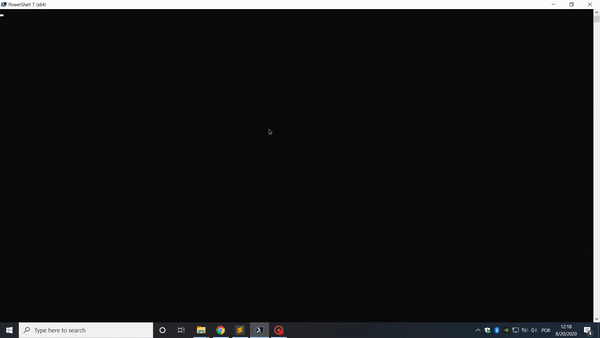
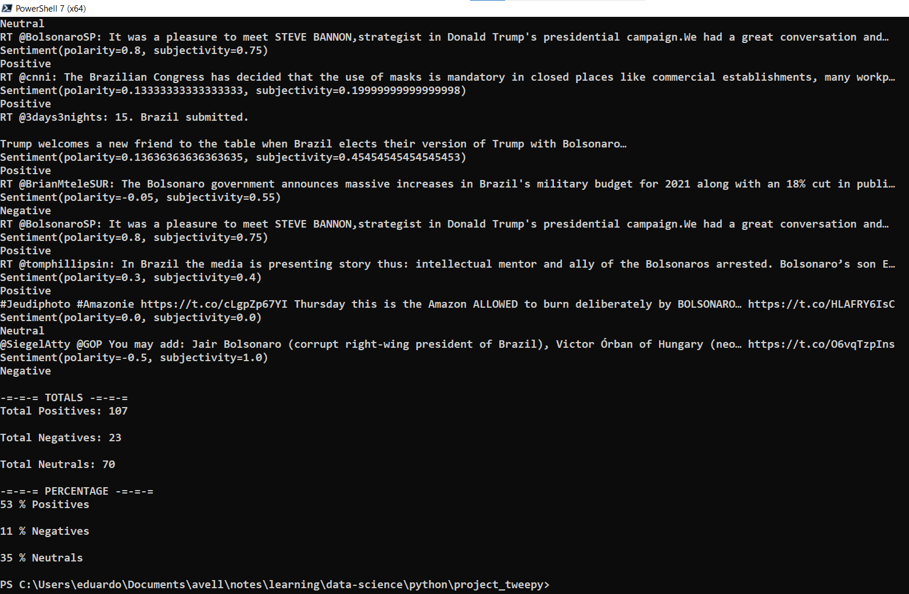

# Análise de sentimento do Twitter.
Este projeto foi desenvolvido por Eduardo Passos, com o objetivo de fornecer um script Python que extrai tweets usando Tweepy e TextBlob para análise de sentimento.

## Exemplo

## Resultados

